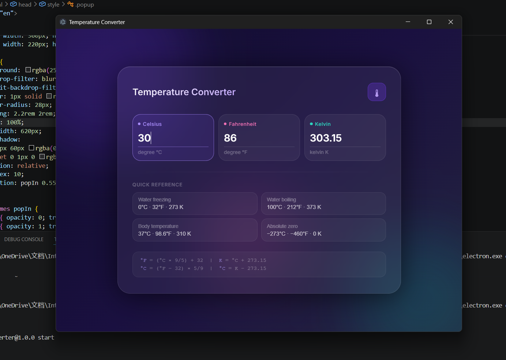

# 🌡 Temperature Converter Desktop App

## 📌 Task 1 – SkillCraft Technology Internship

This project is **Task 1** of my **SkillCraft Technology Internship**. It is a modern **Temperature Converter Desktop Application** developed using **HTML, CSS, JavaScript, and Electron.js**. The application performs real-time temperature conversions between **Celsius (°C), Fahrenheit (°F), and Kelvin (K)** through a clean and interactive desktop interface.

---

## ✨ Features

*  Convert between Celsius, Fahrenheit, and Kelvin
*  Instant real-time conversion
*  Desktop popup application using Electron.js
*  Modern Glassmorphism User Interface
*  Smooth animations and hover effects
*  Responsive design
* Input validation for user input
* Lightweight and easy to use

---

## 🛠 Technologies Used

* HTML5
* CSS3
* JavaScript (ES6)
* Electron.js

---

## 📂 Project Structure

```text
Temperature-Converter/
│
├── index.html
├── main.js
├── package.json
├── package-lock.json
├── README.md
└── screenshot/
      └── screenshot.png
```

---

## 📷 Application Preview



---

## ▶️ How to Run

1. Clone the repository

```bash
git clone https://github.com/your-username/Temperature-Converter.git
```

2. Open the project folder

```bash
cd Temperature-Converter
```

3. Install dependencies

```bash
npm install
```

4. Run the application

```bash
npm start
```

---

## 🎯 Objective

The objective of this project is to build a desktop application that accurately converts temperatures between different scales while providing a modern, user-friendly interface. This project was completed as **Task 1 of the SkillCraft Technology Internship**.

---

## 👨‍💻 Author

Sakshi Ramakabal Maurya B.Tech in Information Technology at K.j. Somaiya institute of technology

---

⭐ If you found this project interesting, feel free to star the repository!
